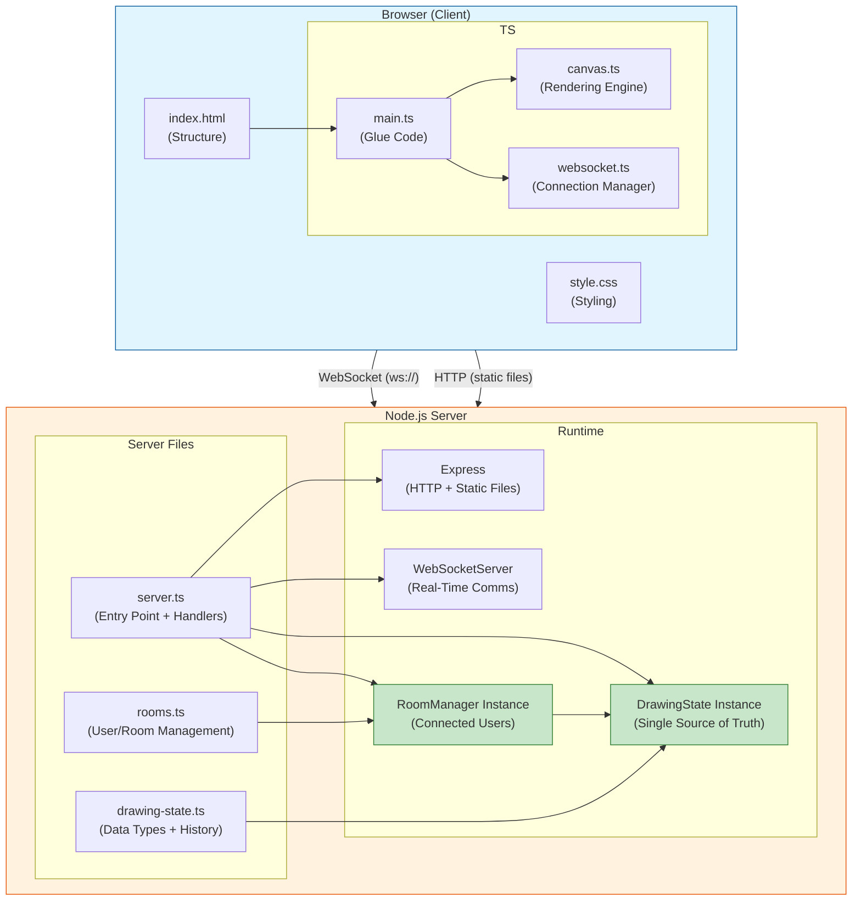
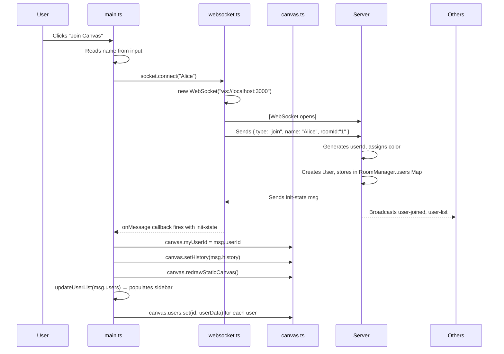
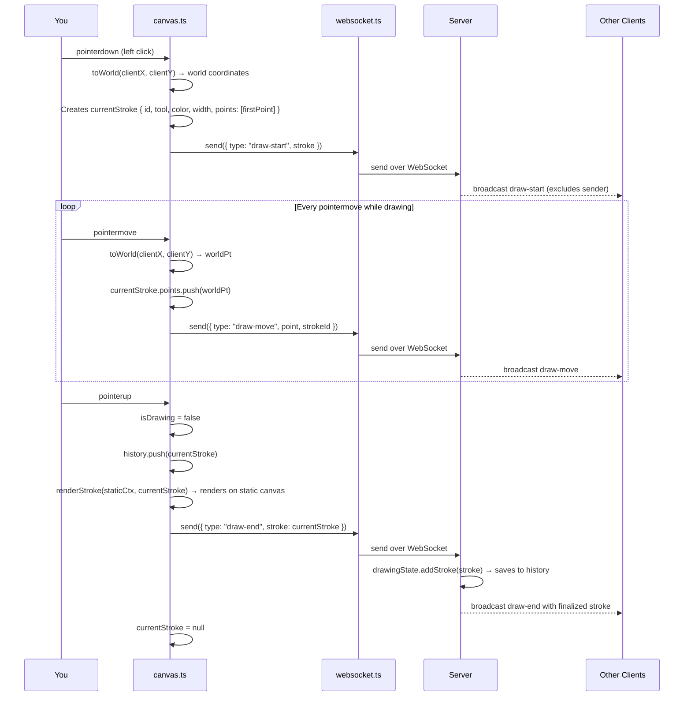
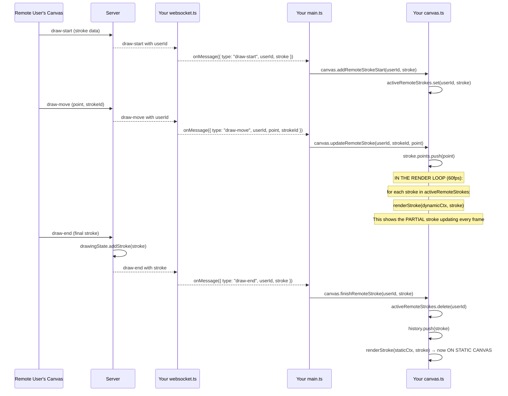
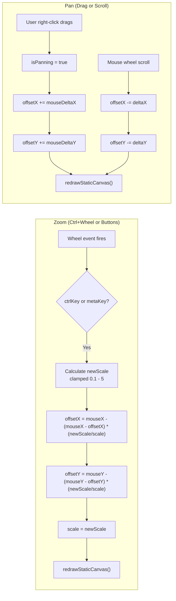
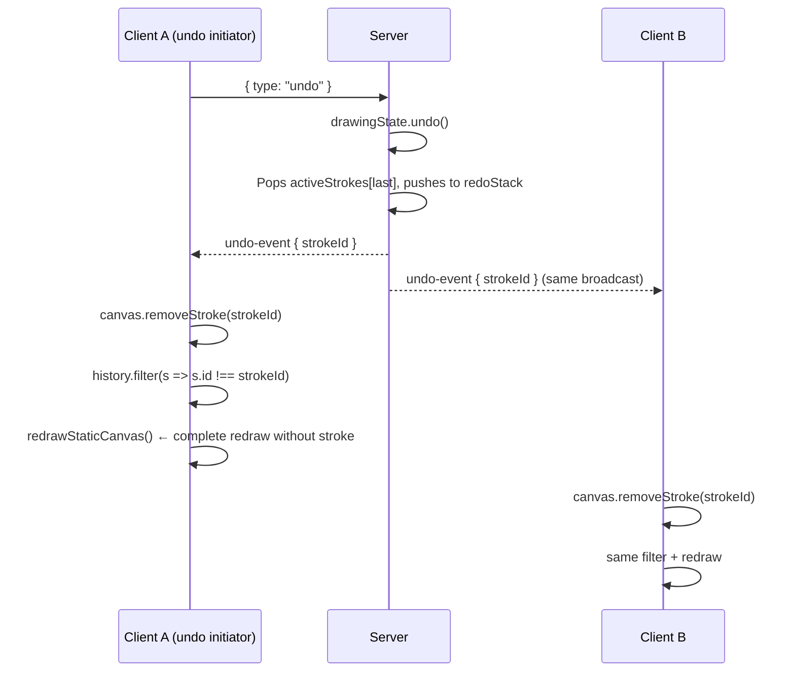
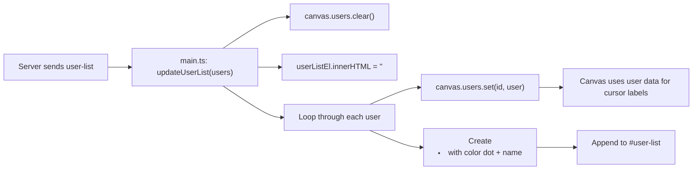

# ARCHITECTURE.md -- SketchSync Technical Architecture

## [Live Demo: https://sketchsync.taranjain.in/](https://sketchsync.taranjain.in/)

---

## Table of Contents

1. [System Overview](#system-overview)
2. [Data Flow Diagram](#data-flow-diagram)
3. [Component Architecture](#component-architecture)
4. [WebSocket Protocol](#websocket-protocol)
5. [Canvas Rendering Pipeline](#canvas-rendering-pipeline)
6. [Undo/Redo Strategy](#undoredo-strategy)
7. [Conflict Resolution](#conflict-resolution)
8. [Room and State Management](#room-and-state-management)
9. [Performance Decisions](#performance-decisions)
10. [Coordinate System and Viewport](#coordinate-system-and-viewport)
11. [Error Handling and Resilience](#error-handling-and-resilience)

---

## System Overview

SketchSync follows a client-server architecture with a single Node.js process acting as the authoritative state holder and WebSocket relay. All clients connect directly to the server via native WebSockets (the `ws` library). There is no intermediary message broker, database, or CDN involved at runtime.



---

## Data Flow Diagram

### a. Joining a Room

**What happens:** User types their name, clicks Join, enters the shared canvas.



**Files involved:** `main.ts:36-42`, `websocket.ts:14-24`, `server.ts:42-67`, `rooms.ts:34-41`

**Key takeaway:** Joining is a three-step handshake: connect WebSocket → send name → receive full state.

---

### b. Drawing a Stroke

**What happens:** User presses mouse, moves, releases — a complete drawing action.




---

### c. Seeing Other Users Draw Live

**What happens:** Another user's stroke appears on your screen in real-time, point by point.



**Key concept:** The dynamic canvas renders the in-progress stroke. The static canvas gets it only when it's finished. This separation is the performance secret of the app.

---


### d. Zoom & Pan

**Zoom** — Two ways to zoom:
1. **Ctrl/Cmd + Mouse Wheel:** Zooms towards the mouse cursor position
2. **Toolbar buttons (+/-):** Zooms towards center of screen

**Pan** — Three ways to pan:
1. **Right-click + drag**
2. **Middle-click + drag**
3. **Shift + left-click + drag**
4. **Mouse wheel (without Ctrl)**



**The zoom math explained:**

When you zoom with Ctrl+Wheel, the point under your mouse cursor should stay in place. This is achieved with:

```
newOffset = mouseScreenPos - (mouseScreenPos - oldOffset) × (newScale / oldScale)
```

**Example:** Say mouse is at screen position (200, 200), current offset is (100, 100), scale is 1.0.
- The world point under the mouse is: `worldX = (200 - 100) / 1.0 = 100`
- User zooms in to scale 2.0
- To keep world point 100 under screen 200: `newOffset = 200 - (200 - 100) × (2.0 / 1.0) = 200 - 200 = 0`
- So offset moves from (100, 100) to (0, 0) — the camera shifts to keep that world point fixed

---

### e. Undo / Redo

**Undo**: Removes the LAST stroke (by anyone — it's global).

**Redo**: Restores the most recently undone stroke.



**Important:** 
- Undo is **global** — anyone can undo anyone's stroke
- The `redoStack` is **cleared** when a new stroke is drawn (standard undo/redo behavior)
- The ordered `activeStrokes[]` array ensures deterministic visual order

---
### f. User List Sidebar

**How it works:**

1. On `init-state` and `user-list` messages, `updateUserList(users)` is called
2. The function clears both the HTML list and the canvas's `users` Map
3. It re-populates both with the fresh user data
4. Each user gets a `<li>` with a colored dot and name



---


## Component Architecture

### Server-Side Components

#### `server.ts` -- Entry Point and Message Router

- Creates an Express HTTP server that serves the `client/` directory as static files.
- Attaches a `WebSocketServer` to the HTTP server.
- On each WebSocket connection, assigns a UUID via `crypto.randomUUID()`.
- Routes incoming JSON messages by `type` field to the appropriate handler.
- Manages the lifecycle of the connection: join, message routing, and cleanup on disconnect.

#### `rooms.ts` -- RoomManager

- `RoomManager` class encapsulates a single room's state:
  - `users: Map<string, User>` -- Connected users with their WebSocket references.
  - `drawingState: DrawingState` -- The room's stroke history.
  - `broadcast(message, excludeId?)` -- Sends a JSON-serialized message to all users in the room except the specified user.
  - `addUser(id, name, ws)` -- Registers a user and assigns a color from a rotating palette.
  - `removeUser(id)` -- Removes a user from the room.
  - `getAllUsersSafe()` -- Returns a serializable array of users (without WebSocket references).
- `rooms: Map<string, RoomManager>` -- Global map of room IDs to managers.
- Two rooms (`public-a`, `public-b`) are pre-initialized at module load time.
- `getOrCreateRoom(roomId)` -- Lazily creates a `RoomManager` for unknown room IDs (private rooms).

#### `drawing-state.ts` -- DrawingState

- `activeStrokes: Stroke[]` -- Ordered history of all committed strokes.
- `redoStack: Stroke[]` -- Stack of undone strokes, cleared on new stroke addition.
- `addStroke(stroke)` -- Appends a stroke and clears the redo stack.
- `removeStroke(strokeId)` -- Filters out a stroke by ID (used by stroke eraser).
- `undo()` -- Pops the last stroke, pushes it to the redo stack, returns it.
- `redo()` -- Pops from the redo stack, pushes to history, returns it.
- `clear()` -- Empties both stacks.
- `getHistory()` -- Returns the current stroke array (sent to new joiners).

### Client-Side Components

#### `websocket.ts` -- SocketManager

- Wraps the browser's native `WebSocket` API.
- `connect(username, roomId)` -- Opens a WebSocket connection, auto-detects `ws://` vs `wss://` based on the page protocol, and sends a `join` message on open.
- `send(data)` -- JSON-serializes and sends data if the socket is open. Silently drops if closed.
- `onMessage(callback)` -- Registers a single callback for all incoming messages.
- `onStatusChange(callback)` -- Notifies on connection/disconnection.
- **Reconnection**: On `onclose`, waits 3 seconds and calls `connect()` again with the stored username and room ID.

#### `canvas.ts` -- CanvasManager

The largest and most complex component. Manages two canvas elements, all input handling, and all rendering.

**State**:
- `history: Stroke[]` -- Local copy of committed strokes (mirrors the server's state).
- `activeRemoteStrokes: Map<string, Stroke>` -- In-progress strokes from remote users (keyed by user ID).
- `remoteCursors: Map<string, Point>` -- Latest cursor position from each remote user.
- `currentStroke: Stroke | null` -- The local user's in-progress stroke.
- `scale, offsetX, offsetY` -- Viewport transformation parameters (zoom and pan).

**Input Handling**:
- Uses Pointer Events (`pointerdown`, `pointermove`, `pointerup`, `pointercancel`) for unified mouse and touch handling.
- `setPointerCapture` ensures continuous event delivery during drag.
- Pan: middle button, right button, or shift+left button.
- Zoom: Ctrl+wheel (anchored at cursor) or dedicated buttons.

**Rendering**:
- `renderStroke(ctx, stroke)` -- Renders a single stroke on the provided context. Handles all tool types: brush/eraser paths via `moveTo`/`lineTo`, shapes via `strokeRect`/`arc`/`lineTo`, and text via `fillText`.
- `redrawStaticCanvas()` -- Clears the static canvas, fills with the CSS background color, applies the viewport transform, and replays all history strokes.
- `startRenderLoop()` -- A `requestAnimationFrame` loop that clears the dynamic canvas, applies the transform, renders in-progress strokes and remote cursors every frame.

**Public API (called from main.ts)**:
- `setHistory(history)` -- Replaces local history (used on init and clear).
- `addRemoteStrokeStart(userId, stroke)` -- Stores a remote in-progress stroke.
- `updateRemoteStroke(userId, strokeId, point)` -- Appends a point to a remote stroke (or overwrites for shapes).
- `finishRemoteStroke(userId, stroke)` -- Moves a remote stroke from active to committed history.
- `updateRemoteCursor(userId, point)` -- Updates a remote cursor position.
- `removeRemoteUser(userId)` -- Cleans up all state for a disconnected user.
- `removeStroke(strokeId)` -- Removes a stroke by ID (undo/erase) and redraws.
- `addStrokeHistory(stroke)` -- Adds a stroke (redo) and redraws.

#### `main.ts` -- Application Entry Point

- Captures all DOM element references.
- `init()` -- Sets up room join handlers, loads saved username from `localStorage`, wires navbar buttons.
- `setupToolbar()` -- Binds click handlers for all toolbar buttons, manages active tool state, wires color picker, width slider, undo/redo/clear/zoom buttons, eraser mode toggle, shape type select, and theme toggle.
- `setupSocketEvents()` -- Routes incoming WebSocket messages to the appropriate `CanvasManager` method.
- `updateUserList(users)` -- Renders the user list in the sidebar DOM.

---

## WebSocket Protocol

All messages are JSON objects with a `type` field. Below is the complete protocol specification.

### Client to Server

| Type            | Payload                                          | Description                                    |
|-----------------|--------------------------------------------------|------------------------------------------------|
| `join`          | `{ name: string, roomId: string }`               | Join a room. Server responds with `init-state` |
| `draw-start`    | `{ stroke: Stroke }`                             | Begin a new stroke                             |
| `draw-move`     | `{ point: Point, strokeId: string }`             | Append a point to the current stroke           |
| `draw-end`      | `{ stroke: Stroke }`                             | Finalize and commit a stroke                   |
| `cursor-move`   | `{ point: Point }`                               | Update cursor position (when not drawing)      |
| `undo`          | `{}`                                             | Request undo of the last stroke                |
| `redo`          | `{}`                                             | Request redo of the last undone stroke         |
| `clear`         | `{}`                                             | Request clearing all strokes                   |
| `erase-stroke`  | `{ strokeId: string }`                           | Request deletion of a specific stroke          |

### Server to Client

| Type                 | Payload                                                       | Description                                    |
|----------------------|---------------------------------------------------------------|------------------------------------------------|
| `init-state`         | `{ userId, color, history: Stroke[], users: User[] }`         | Full state dump on join                        |
| `user-joined`        | `{ user: { id, name, color } }`                               | A new user joined the room                     |
| `user-left`          | `{ userId: string }`                                          | A user disconnected                            |
| `user-list`          | `{ users: { id, name, color }[] }`                            | Complete user roster update                    |
| `draw-start`         | `{ userId, stroke: Stroke }`                                  | A remote user started drawing                  |
| `draw-move`          | `{ userId, point: Point, strokeId: string }`                  | A remote user's stroke in progress             |
| `draw-end`           | `{ userId, stroke: Stroke }`                                  | A remote user finished a stroke                |
| `cursor-move`        | `{ userId, point: Point }`                                    | A remote user moved their cursor               |
| `undo-event`         | `{ strokeId: string }`                                        | A stroke was undone (remove by ID)             |
| `redo-event`         | `{ stroke: Stroke }`                                          | A stroke was redone (add to history)           |
| `clear-event`        | `{}`                                                          | Canvas was cleared                             |
| `erase-stroke-event` | `{ strokeId: string }`                                        | A specific stroke was erased (remove by ID)    |

### Message Flow Patterns

- **Unidirectional relay**: `draw-start`, `draw-move`, and `cursor-move` are forwarded to all other users in the room without server-side state changes. The server stamps `userId` on each relay.
- **State-modifying relay**: `draw-end`, `undo`, `redo`, `clear`, and `erase-stroke` modify the server's `DrawingState` and then broadcast the result. For `undo` and `redo`, the server also sends the event back to the requesting client (since the client does not optimistically apply the operation).
- **Exclusion**: `draw-start`, `draw-move`, `draw-end`, and `erase-stroke` exclude the sender from the broadcast. The sender already has the local state. `undo`, `redo`, and `clear` include the sender because the server is the authority.

---

## Canvas Rendering Pipeline

```
                              ┌─────────────────────────────┐
                              │      Browser Viewport        │
                              │                              │
                              │  ┌────────────────────────┐  │
                              │  │   Dynamic Canvas (z:2)  │  │
                              │  │   pointer-events: all   │  │
                              │  │                          │  │
                              │  │  • Local in-progress     │  │
                              │  │    stroke                │  │
                              │  │  • Remote in-progress    │  │
                              │  │    strokes               │  │
                              │  │  • Remote cursor dots    │  │
                              │  │    + name labels         │  │
                              │  │                          │  │
                              │  │  Cleared + redrawn       │  │
                              │  │  every frame (rAF)       │  │
                              │  └────────────────────────┘  │
                              │  ┌────────────────────────┐  │
                              │  │   Static Canvas (z:1)   │  │
                              │  │   pointer-events: none  │  │
                              │  │                          │  │
                              │  │  • All committed strokes │  │
                              │  │    from history[]        │  │
                              │  │                          │  │
                              │  │  Redrawn only on         │  │
                              │  │  history change or       │  │
                              │  │  viewport transform      │  │
                              │  └────────────────────────┘  │
                              └─────────────────────────────┘

                              Rendering is decoupled:
                              - Static: on-demand (state change)
                              - Dynamic: every frame (requestAnimationFrame)
```

### Render Path Detail

1. **Static canvas redraw** (`redrawStaticCanvas`):
   - Reset transform to identity.
   - Fill the entire canvas with `--canvas-bg` (read from computed CSS).
   - Apply viewport transform (`setTransform(scale, 0, 0, scale, offsetX, offsetY)`).
   - Iterate `history[]` and call `renderStroke()` for each.

2. **Dynamic canvas frame** (`startRenderLoop`):
   - `clearRect` the entire canvas.
   - Apply viewport transform.
   - Render `currentStroke` (local in-progress) if drawing.
   - Render all `activeRemoteStrokes` values.
   - Reset transform to identity (screen coordinates).
   - For each entry in `remoteCursors`, convert world coordinates to screen coordinates and draw a colored circle with a name label.
   - Schedule next frame via `requestAnimationFrame`.

---

## Undo/Redo Strategy

### Design: Server-Authoritative, Global Scope

The undo/redo system is intentionally **global** (not per-user) and **server-authoritative** (not optimistic).

**Rationale**: A per-user undo system in a collaborative environment introduces significant complexity. If User A draws stroke 1, User B draws stroke 2, and User A undoes, should stroke 1 be removed? This creates visual confusion because User B's stroke 2 might visually depend on stroke 1's position. A global stack avoids this: undo always removes the most recent stroke, which is the most intuitive behavior for a shared whiteboard.

### Implementation

**Server** (`DrawingState`):
```
activeStrokes: [S1, S2, S3, S4]     redoStack: []

── undo() ──►
activeStrokes: [S1, S2, S3]         redoStack: [S4]
broadcasts: undo-event {strokeId: S4.id}

── undo() ──►
activeStrokes: [S1, S2]             redoStack: [S4, S3]
broadcasts: undo-event {strokeId: S3.id}

── redo() ──►
activeStrokes: [S1, S2, S3]         redoStack: [S4]
broadcasts: redo-event {stroke: S3}

── new stroke S5 ──►
activeStrokes: [S1, S2, S3, S5]     redoStack: []   (cleared)
broadcasts: draw-end {stroke: S5}
```

**Client** (on receiving events):
- `undo-event`: Filters `history[]` to remove the stroke with the given ID. Calls `redrawStaticCanvas()`.
- `redo-event`: Pushes the received stroke to `history[]`. Calls `redrawStaticCanvas()`.
- `clear-event`: Sets `history = []`. Calls `redrawStaticCanvas()`.

### Why Full Redraw on Undo

When a stroke is removed from the middle of the history (or the most recent stroke overlaps with earlier ones), there is no way to "unpaint" it without knowing what was underneath. A full replay of all remaining strokes against a clean background is the only correct approach without maintaining a pixel-level snapshot stack. For the expected canvas sizes (hundreds of strokes), this is well within real-time performance budgets.

---

## Conflict Resolution

### No Operational Transform Needed

Drawing strokes are additive, independent objects. Two users drawing simultaneously in the same region produce two separate strokes that do not conflict at the data level. Both strokes are added to the history in the order the server receives their `draw-end` messages. All clients replay the same ordered history, so all canvases converge.

### Undo Conflict Scenario

**Scenario**: User A draws stroke S1. User B draws stroke S2. User A presses Undo.

**What happens**: The server's undo pops S2 (the most recent stroke, drawn by User B), not S1. Both User A and User B receive `undo-event {strokeId: S2.id}` and remove S2 from their local history. This is consistent and deterministic: all clients agree on the state.

**Trade-off**: User A might have expected to undo their own stroke (S1), not User B's. This is the inherent trade-off of a global undo stack. For a shared whiteboard use case, this behavior is appropriate and commonly expected (similar to Google Jamboard and other collaborative tools).

### Erase Conflict Scenario

**Scenario**: User A and User B both try to erase the same stroke simultaneously.

**What happens**: Both send `erase-stroke {strokeId: X}` to the server. The server processes them sequentially. The first call removes the stroke from `DrawingState` and broadcasts `erase-stroke-event`. The second call's `removeStroke` is a no-op (the stroke is already gone), and no broadcast is sent. On the clients, the first event removes the stroke; the second event (if it arrives) calls `filter` on an already-absent ID, which is also a no-op. The system is idempotent.

---

## Room and State Management

### Room Lifecycle

```
Server Startup
    │
    ├── rooms.set("public-a", new RoomManager())
    ├── rooms.set("public-b", new RoomManager())
    │
    │   (User joins "secret-room-42")
    │
    ├── getOrCreateRoom("secret-room-42")
    │   └── rooms.set("secret-room-42", new RoomManager())
    │
    │   (All users leave "secret-room-42")
    │
    │   Room persists in memory with empty user list
    │   but retained DrawingState (strokes survive)
    │
    │   (New user joins "secret-room-42")
    │
    └── getOrCreateRoom("secret-room-42")
        └── returns existing RoomManager with full history
```

### State Isolation

Each `RoomManager` maintains completely independent state:
- Its own `DrawingState` (stroke history and redo stack).
- Its own `users` map.
- Its own `broadcast()` scope.

A message in Room A is never delivered to a user in Room B. There is no cross-room interaction.

### User Lifecycle

1. **WebSocket connect**: Server assigns a UUID. No room association yet.
2. **`join` message**: Server adds the user to the specified room, sends `init-state` to the joining user, broadcasts `user-joined` and `user-list` to others.
3. **Drawing/interaction**: Messages are routed through the room's broadcast.
4. **WebSocket close**: Server removes the user from the room, broadcasts `user-left` and `user-list` to remaining users. The client's `SocketManager` triggers auto-reconnect after 3 seconds.

---

## Performance Decisions

| Decision | Alternative Considered | Rationale |
|----------|----------------------|-----------|
| Dual-canvas architecture | Single canvas with dirty rectangles | Simpler implementation. Dirty rectangle tracking is complex with arbitrary overlapping strokes. The dual-canvas approach is a well-known pattern for separating persistent and transient rendering. |
| Full redraw on undo | Incremental undo with pixel snapshots | Pixel snapshot stacks consume significant memory (width * height * 4 bytes per snapshot). Full replay is fast enough for hundreds of strokes and is always correct. |
| Point-by-point streaming | Batched stroke updates (e.g., every 50ms) | Lowest latency for real-time feel. Bandwidth is acceptable for the expected user count. The `requestAnimationFrame` render loop naturally batches visual updates at 60 FPS regardless of event frequency. |
| `{ alpha: false }` on static canvas | Default alpha channel | Browser optimization hint. When the canvas is known to be fully opaque, the compositor can skip alpha blending, improving rendering performance. |
| World-coordinate storage | Screen-coordinate storage | Zoom and pan do not require re-sampling stroke data. All coordinates are resolution-independent. |
| `requestAnimationFrame` for dynamic canvas | `setInterval` or event-driven redraw | Synchronized with the display refresh rate. No wasted frames. No frame drops from event handler overhead. |
| Pointer Events API | Mouse Events + Touch Events separately | Unified event model for mouse, touch, and pen input. Single code path for all input devices. |
| `setPointerCapture` | Manual tracking with document-level listeners | Ensures continuous event delivery during drag even if the pointer leaves the canvas boundary. Prevents stroke discontinuities. |
| `ctx.setTransform` for viewport | Manual coordinate multiplication | Hardware-accelerated affine transform. Single API call applies zoom and pan to all subsequent draw operations. |

---

## Coordinate System and Viewport

```
  Screen Space (pixels)          World Space (logical units)
  ┌──────────────────────┐       ┌───────────────────────────────┐
  │(0,0)                 │       │                               │
  │   ┌───────────┐      │       │       ┌───────────┐           │
  │   │ Visible   │      │  ◄──  │       │ Visible   │           │
  │   │ Viewport  │      │       │       │ Viewport  │           │
  │   └───────────┘      │       │       └───────────┘           │
  │          (W,H)       │       │                               │
  └──────────────────────┘       │            (infinite)         │
                                 └───────────────────────────────┘

  Screen → World:
    worldX = (screenX - offsetX) / scale
    worldY = (screenY - offsetY) / scale

  World → Screen:
    screenX = worldX * scale + offsetX
    screenY = worldY * scale + offsetY
```

- All stroke points are stored in **world space**.
- The viewport transform (`scale`, `offsetX`, `offsetY`) is applied via `ctx.setTransform` before rendering.
- Remote cursor positions are stored in world space and converted to screen space in the render loop for overlay display.

---

## Error Handling and Resilience

### Server-Side

- All incoming WebSocket messages are wrapped in a `try-catch` block. Malformed JSON or unexpected message structures are caught and logged without crashing the server or disconnecting the client.
- Messages received before the client has joined a room (`currentRoomId === null`) are silently ignored.

### Client-Side

- `SocketManager.send()` checks `ws.readyState === WebSocket.OPEN` before sending. Messages are silently dropped if the connection is not open.
- `SocketManager.onmessage` wraps JSON parsing in a `try-catch`.
- Destructive actions (Clear Canvas, Leave Room) are guarded by `confirm()` dialogs.
- The auto-reconnect loop ensures the client recovers from transient network failures without user intervention.
- On reconnect, the `join` message triggers a full `init-state` response, reconstructing the canvas from the server's authoritative history and eliminating any state drift.
