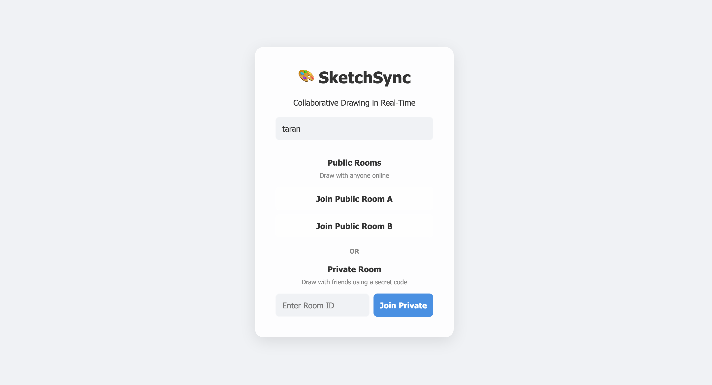

# SketchSync -- Real-Time Collaborative Drawing Canvas

## [Live Demo: https://sketchsync.taranjain.in/](https://sketchsync.taranjain.in/)

---

**SketchSync** is a multi-user collaborative drawing application built entirely with vanilla TypeScript, the HTML5 Canvas API, and native WebSockets. Multiple users can draw simultaneously on the same infinite canvas with real-time stroke synchronization, live cursor tracking, and a globally consistent undo/redo system -- all without a single frontend framework or drawing library.

---

## Table of Contents

1. [Screenshots](#screenshots)
2. [Feature Overview](#feature-overview)
3. [Technical Stack](#technical-stack)
4. [Project Structure](#project-structure)
5. [Setup and Installation](#setup-and-installation)
6. [Testing with Multiple Users](#testing-with-multiple-users)
7. [Deployment](#deployment)
8. [Detailed Feature Documentation](#detailed-feature-documentation)
9. [Synchronization and Conflict Resolution](#synchronization-and-conflict-resolution)
10. [Performance Optimizations](#performance-optimizations)
11. [Problems Encountered and Solutions](#problems-encountered-and-solutions)
12. [Known Limitations](#known-limitations)
13. [Time Spent](#time-spent)

---

## Screenshots

### Room Selection Screen


### Collaborative Canvas with Multiple Users


---

## Feature Overview

### Drawing Tools
- **Brush** -- Freehand drawing with smooth path rendering using the Canvas 2D API. Supports configurable color and stroke width.
- **Pixel Eraser** -- Draws in the canvas background color to simulate pixel-level erasure. Operates identically to the brush in terms of stroke mechanics.
- **Stroke Eraser** -- An intelligent whole-stroke eraser that performs real-time hit-testing against all committed strokes using point-to-line-segment distance calculations. When the pointer passes near a stroke, the entire stroke is removed from the canvas and the deletion is broadcast to all connected users.
- **Shapes** -- Supports three geometric primitives: **Rectangle**, **Circle**, and **Line**. Shapes are drawn by click-and-drag and rendered live as the user drags. Shape type is selected from a dropdown that appears when the shapes tool is active.
- **Text** -- Click anywhere on the canvas to spawn a floating text input. On confirmation (Enter key or blur), the text is committed as a stroke, rendered at the click position, and synchronized to all users.
- **Color Picker** -- Full-spectrum color selection via a native HTML color input.
- **Stroke Width Slider** -- Adjustable stroke width via a range slider, affecting brush, eraser, shapes, and text size.

### Canvas Navigation
- **Infinite Canvas** -- The canvas supports arbitrary panning and zooming via affine transformations (`ctx.setTransform`). All strokes are stored in world coordinates and rendered through the current viewport transform.
- **Pan** -- Middle-click drag, right-click drag, or Shift+left-click drag to pan. Two-finger scroll (trackpad) also pans the canvas.
- **Zoom** -- Ctrl+scroll (or pinch) to zoom in/out, anchored at the cursor position. Dedicated zoom-in, zoom-out, and reset-zoom buttons are provided in the toolbar.

### Real-Time Collaboration
- **Live Stroke Streaming** -- Drawing data is streamed point-by-point via WebSocket as the user draws (`draw-start`, `draw-move`, `draw-end`). Other users see strokes appear in real time, not after completion.
- **Live Cursor Tracking** -- When a user moves their pointer without drawing, `cursor-move` events are emitted. Other users see a colored dot with the remote user's name rendered at the cursor position on the dynamic canvas layer.
- **User Presence** -- A sidebar displays all connected users with their assigned color indicator. Users receive `user-joined`, `user-left`, and `user-list` events to maintain an accurate roster.
- **Automatic Color Assignment** -- Each user is assigned a unique color from a curated palette upon joining a room.

### Global Undo/Redo
- **Server-Authoritative** -- Undo and redo operations are processed on the server. The server maintains an ordered stroke history and a redo stack. When any user triggers undo, the server pops the most recent stroke and broadcasts an `undo-event` containing the stroke ID to all clients. Every client removes that stroke from its local history and redraws.
- **Cross-User Scope** -- Undo/redo operates on the global canvas history, not per-user history. Any user can undo the most recent stroke regardless of who drew it.
- **Redo Stack Reset** -- When a new stroke is committed, the redo stack is cleared, consistent with standard undo/redo semantics.

### Canvas Clear
- A "Clear Canvas" button, guarded by a confirmation dialog, sends a `clear` event to the server. The server resets all stroke history and redo state, then broadcasts a `clear-event` to all clients.

### Room System
- **Two Public Rooms** -- `Public Room A` and `Public Room B` are pre-initialized on server startup. Any user can join either room. Drawing state persists as long as the server process is running.
- **Unlimited Private Rooms** -- Users can create or join a private room by entering an arbitrary Room ID. The server lazily instantiates a new `RoomManager` for any previously unseen room ID. Private rooms are completely isolated from public rooms and from each other.
- **Room Isolation** -- Each room maintains its own `DrawingState` (stroke history and redo stack), its own user roster, and its own broadcast scope. Events in one room are invisible to users in another room.
- **Persistent Drawing State** -- Within a server session, all strokes are retained in memory. When a new user joins a room, the server sends the complete stroke history via an `init-state` message, allowing the new user's canvas to be fully reconstructed.

### User Experience
- **Username Persistence** -- The entered username is saved to `localStorage`. On subsequent visits, the name field is pre-filled, eliminating redundant input.
- **Light and Dark Themes** -- A theme toggle switches between light and dark modes by toggling a CSS class on the document body. CSS custom properties (`--bg-color`, `--canvas-bg`, `--text-color`, `--glass-bg`, `--glass-border`, etc.) control the entire color scheme. The canvas background dynamically reads the computed CSS variable to ensure visual consistency.
- **Responsive Layout** -- The UI adapts to screen width:
  - On desktop, the user sidebar is always visible alongside the canvas.
  - Below 768px, the sidebar is hidden off-screen and can be toggled via a "Users" button in the navbar. The toolbar wraps and enables horizontal scrolling to fit smaller screens.
- **Mobile and Touch Support** -- The application uses the Pointer Events API (`pointerdown`, `pointermove`, `pointerup`, `pointercancel`) with `touch-action: none` on the canvas. This captures all touch gestures natively without browser interference from pull-to-refresh or native zoom, enabling full drawing capability on phones and tablets.
- **Navigation Bar** -- A fixed navbar at the top displays the application logo, a "Leave Room" button (returns to the join screen), and the theme toggle. The "Users" button appears only on smaller screens where the sidebar is not visible.
- **Connection Status Indicator** -- A colored dot in the sidebar header indicates WebSocket connection state (green for connected, red for disconnected).
- **Automatic Reconnection** -- If the WebSocket connection drops, the client automatically attempts to reconnect after 3 seconds, re-joining the same room with the same username.

---

## Technical Stack

| Layer      | Technology                       | Rationale                                                                 |
|------------|----------------------------------|---------------------------------------------------------------------------|
| Frontend   | Vanilla TypeScript, HTML5 Canvas | Assignment requirement: no frameworks, no drawing libraries               |
| Backend    | Node.js, Express, `ws`           | Lightweight HTTP server with native WebSocket support                     |
| Protocol   | Native WebSockets (`ws` library) | Lower overhead than Socket.io; direct control over the message protocol   |
| Build      | TypeScript Compiler (`tsc`)      | Type safety with zero runtime dependencies beyond Node.js standard library|
| Dev Tools  | `tsx` (watch mode)               | Fast server restarts during development                                   |

### Why Native WebSockets Over Socket.io

Socket.io provides conveniences such as automatic reconnection, room abstractions, and fallback transports. However, for this project, native WebSockets (`ws`) were chosen for the following reasons:

1. **Transparency** -- The WebSocket protocol is used directly, making the message flow fully visible and debuggable without framework abstractions.
2. **Minimal Overhead** -- No additional protocol negotiation (Socket.io uses its own handshake layer on top of WebSocket). This reduces latency for high-frequency drawing events.
3. **Room Management Control** -- Rooms are implemented explicitly via a `Map<string, RoomManager>`, giving full control over broadcast scoping, user management, and state isolation.
4. **Reconnection** -- Implemented manually with a simple `setTimeout` retry, which is sufficient for this use case and keeps the dependency surface minimal.

---

## Project Structure

```
collaborative-canvas/
├── client/
│   ├── index.html             # Application markup: join overlay, sidebar, toolbar, canvas
│   ├── style.css              # Complete styling: themes, responsive layout, glassmorphism
│   ├── canvas.ts              # Canvas rendering engine, input handling, stroke management
│   ├── websocket.ts           # WebSocket client wrapper with reconnection logic
│   ├── main.ts                # Application entry point: UI wiring, socket event routing
│   ├── tsconfig.json          # Client-side TypeScript configuration (ES modules)
│   └── dist/                  # Compiled JavaScript output (served statically)
├── server/
│   ├── server.ts              # Express HTTP server + WebSocket server, message routing
│   ├── rooms.ts               # RoomManager class, user management, broadcast logic
│   └── drawing-state.ts       # DrawingState class: stroke history, undo/redo stacks
├── dist/                      # Compiled server JavaScript output
├── package.json               # Dependencies and scripts
├── tsconfig.json              # Server-side TypeScript configuration
├── ARCHITECTURE.md            # Detailed architecture documentation
└── README.md                  # This file
```

---

## Setup and Installation

### Prerequisites

- Node.js (v18 or later recommended)
- npm

### Local Development

```bash
# Clone the repository
git clone https://github.com/taranjain/sketchSync.git
cd sketchSync

# Install dependencies
npm install

# Build both client and server TypeScript
npm run build

# Start the production server
npm start
```

The server will start at `http://localhost:3000`.

### Development Mode (with Hot Reload)

```bash
# Terminal 1: Watch and recompile client TypeScript
npm run dev:client

# Terminal 2: Watch and restart server on changes
npm run dev:server
```

### Available Scripts

| Script            | Command                           | Purpose                                      |
|-------------------|-----------------------------------|----------------------------------------------|
| `npm start`       | `node dist/server/server.js`      | Run the production server                    |
| `npm run build`   | `build:client && build:server`    | Compile all TypeScript                       |
| `npm run build:client` | `tsc -p client/tsconfig.json` | Compile client TypeScript to `client/dist/`  |
| `npm run build:server` | `tsc -p tsconfig.json`        | Compile server TypeScript to `dist/`         |
| `npm run dev:server`   | `tsx watch server/server.ts`  | Development server with auto-restart         |
| `npm run dev:client`   | `tsc -p client/tsconfig.json --watch` | Client TypeScript watch mode          |

---

## Testing with Multiple Users

### Local Testing

1. Start the server with `npm start`.
2. Open `http://localhost:3000` in two or more browser tabs or windows.
3. Enter a different username in each tab.
4. Join the same room (e.g., Public Room A) from all tabs.
5. Draw in one tab and observe the strokes appearing in real time in the other tabs.
6. Test undo/redo from different tabs to observe global operation ordering.

### Cross-Device Testing

1. Ensure all devices are on the same local network.
2. Find the host machine's local IP address (e.g., `192.168.x.x`).
3. Open `http://192.168.x.x:3000` on other devices.
4. Join the same room and draw collaboratively.

### Remote Testing

Visit the deployed instance at [https://sketchsync.taranjain.in/](https://sketchsync.taranjain.in/) from multiple devices or share the link with another person.

---

## Deployment

The application is deployed at **[https://sketchsync.taranjain.in/](https://sketchsync.taranjain.in/)** on [Render](https://render.com) and served behind a custom domain with HTTPS.

### Deployment Configuration

- **Platform**: Render (Web Service)
- **Build Command**: `npm install && npm run build`
- **Start Command**: `npm start`
- **Environment**: Node.js
- **WebSocket Protocol**: The client automatically detects `https:` and upgrades to `wss:` for secure WebSocket connections. No additional configuration is required.
- **Custom Domain**: `sketchsync.taranjain.in` is configured as a custom domain on Render, with DNS CNAME records pointing to the Render service endpoint. Render provisions and manages the TLS certificate automatically.

---

## Detailed Feature Documentation

### Dual-Canvas Rendering Architecture

The application uses two overlapping HTML5 Canvas elements:

- **Static Canvas** (`#static-canvas`) -- Renders all committed strokes from the history array. This canvas is only redrawn when the history changes (stroke added, removed, or viewport changed). It uses `{ alpha: false }` for the 2D context to enable browser compositing optimizations.
- **Dynamic Canvas** (`#dynamic-canvas`) -- Layered on top of the static canvas. Cleared and redrawn every frame via `requestAnimationFrame`. Renders:
  - The local user's in-progress stroke (not yet committed).
  - All remote users' in-progress strokes (received via `draw-start` and `draw-move`).
  - Remote cursor indicators (colored dot + username label).

This separation eliminates the need to redraw the entire stroke history on every frame. Only transient, in-progress data is re-rendered per frame, while the static history is composited underneath by the browser.

### Stroke Data Model

Every drawing operation -- brush stroke, eraser path, shape, or text placement -- is represented as a `Stroke` object:

```typescript
interface Stroke {
    id: string;          // Unique identifier (random base-36 string)
    userId: string;      // UUID of the user who created the stroke
    tool: Tool;          // 'brush' | 'eraser' | 'stroke-eraser' | 'shape' | 'text'
    color: string;       // Hex color string
    width: number;       // Stroke width in pixels
    points: Point[];     // Array of {x, y} coordinates in world space
    shapeType?: ShapeType; // 'rectangle' | 'circle' | 'line' (only for shapes)
    text?: string;       // Text content (only for text tool)
}
```

This unified model allows undo, redo, and erase operations to work identically across all tool types.

### Stroke Eraser: Hit-Testing Algorithm

The stroke eraser does not paint over pixels. Instead, it performs geometric hit-testing against every stroke in the history:

1. For each stroke, the eraser checks every line segment defined by consecutive points.
2. For each segment, it computes the minimum squared distance from the eraser's current world-space position to the segment using the point-to-line-segment distance formula.
3. The hit threshold is `(stroke.width / 2) + (eraser.width / 2)`, accounting for both the stroke's visual thickness and the eraser's effective radius.
4. If a hit is detected, the stroke is removed from the local history, the canvas is redrawn, and an `erase-stroke` message is sent to the server. The server removes the stroke from its authoritative history and broadcasts the deletion to all other clients.

### Shape Rendering

Shapes use a two-point model: `points[0]` is the anchor (where the mouse was pressed) and `points[1]` is the drag endpoint. During drawing, `points[1]` is overwritten on each `pointermove` event rather than appended, so the shape updates in real time without accumulating unnecessary data.

- **Rectangle**: Rendered via `ctx.strokeRect(x, y, width, height)`.
- **Circle**: The radius is computed as the Euclidean distance between the two points. Rendered via `ctx.arc`.
- **Line**: A straight line from `points[0]` to `points[1]` via `ctx.moveTo` and `ctx.lineTo`.

### Text Rendering

Text strokes store a single point (the placement position) and the text content. They are rendered using `ctx.fillText` with a font size derived from the stroke width (`width * 4` pixels). The text uses the Inter font family for visual consistency.

---

## Synchronization and Conflict Resolution

### WebSocket Protocol

All messages are JSON-serialized. The complete protocol is documented in [ARCHITECTURE.md](ARCHITECTURE.md).

### Accuracy of Synchronization

Synchronization accuracy is maintained through several mechanisms:

1. **Server-Authoritative State** -- The server maintains the canonical stroke history. When a new client joins, it receives the full history via `init-state`, ensuring its canvas matches the current room state exactly.
2. **Point-by-Point Streaming** -- Drawing data is transmitted on every `pointermove` event, not batched. This ensures remote users see strokes appear with minimal latency, at the cost of higher message volume (which is acceptable for the expected user count).
3. **User ID Injection** -- The server stamps every broadcast message with the originating `userId`. This prevents spoofing and ensures each client can correctly attribute strokes and cursor positions.

### Handling Network Issues

1. **Automatic Reconnection** -- On WebSocket close, the client retries the connection after a 3-second delay, re-sending the `join` message with the same username and room ID. The server responds with the current `init-state`, so the reconnected client's canvas is reconstructed from the authoritative history.
2. **Graceful Degradation** -- If the WebSocket is not in the `OPEN` state, `SocketManager.send()` silently drops the message. Drawing continues to work locally; strokes are simply not transmitted until the connection is restored.
3. **Connection Status Indicator** -- A visual indicator in the sidebar shows the current connection state, so the user is aware if synchronization is interrupted.

### Conflict Resolution Strategy

Simultaneous drawing in overlapping areas is handled through the following design decisions:

1. **No Operational Conflicts** -- Drawing strokes are additive. Two users drawing simultaneously in the same area produce two independent strokes that are both recorded in the history. There is no pixel-level merge conflict because strokes are discrete objects, not pixel buffers.
2. **Global Undo Ordering** -- Undo pops the most recent stroke from the server's ordered history, regardless of which user created it. This is a deliberate design choice: the undo/redo system operates on the shared canvas as a whole, not on individual user histories. This avoids the complexity of per-user undo stacks while maintaining consistency.
3. **Deterministic Replay** -- Because all clients replay the same ordered history of stroke objects (received via `init-state` at join time and maintained via real-time events), all canvases converge to the same visual state.

---

## Performance Optimizations

### Path Optimization for Smooth Drawing

- Strokes are recorded as arrays of `{x, y}` points sampled on every `pointermove` event. The Canvas 2D API's `lineTo` path rendering with `lineCap: 'round'` and `lineJoin: 'round'` produces visually smooth curves without requiring Bezier interpolation.
- Points are stored in **world coordinates** (not screen coordinates), so zooming and panning do not require re-sampling or re-computing point data.

### Handling High-Frequency Mouse Events

- The Pointer Events API fires at the display refresh rate (typically 60 Hz or higher on modern displays). Every event is processed and transmitted. The `requestAnimationFrame` render loop decouples event processing from rendering, so event handling never blocks the frame pipeline.
- Pointer capture (`setPointerCapture`) ensures that `pointermove` events continue to fire even if the pointer leaves the canvas element during a drag, preventing stroke discontinuities.

### Layer Management for Undo/Redo

- Undo does not re-render incrementally. When a stroke is removed, the static canvas is fully cleared and all remaining strokes are replayed (`redrawStaticCanvas`). This is the correct trade-off for correctness: because strokes can overlap arbitrarily, removing one stroke from the middle of the history requires a full replay to produce the correct visual result.
- The redo stack is a simple array maintained on the server. Redo re-adds the most recently undone stroke to the history and broadcasts it.

### Efficient Redraw Strategy

- The static canvas is only redrawn when the history or viewport changes -- not on every frame. The dynamic canvas is redrawn every frame but contains only in-progress strokes and cursor indicators, which is a minimal workload.
- The canvas background color is read from the computed CSS custom property (`--canvas-bg`) at redraw time, ensuring theme changes are reflected immediately without requiring a separate re-render path.

---

## Problems Encountered and Solutions

### Problem 1: Remote Stroke Ghost After Undo

**Symptom**: When User A finished drawing a stroke, User B could see it. But when User B clicked Undo, the stroke appeared to persist visually even though it was removed from the history.

**Root Cause**: When the server broadcast the `draw-end` message, it failed to attach the `userId` to the root of the message payload. On the receiving client, `msg.userId` resolved to `undefined`. The client then attempted to delete `undefined` from the `activeRemoteStrokes` map, which was a no-op. The stroke remained permanently stuck in the active remote strokes map and was rendered on every frame by the dynamic canvas render loop -- even after it had been correctly removed from the static history by the undo operation.

**Solution**: The server was corrected to explicitly set `userId` on the `draw-end` broadcast payload:
```typescript
currentRoom.broadcast({
    type: 'draw-end',
    userId: userId,   // This was the missing line
    stroke: stroke
}, userId);
```
This ensured that the receiving client could correctly look up and delete the active remote stroke, allowing the dynamic canvas to stop rendering it.

### Problem 2: Cursor Offset After Adding the Navigation Bar

**Symptom**: After adding a navigation bar to the top of the application, all drawing strokes appeared approximately 60 pixels below the actual cursor position.

**Root Cause**: The initial implementation placed the navbar in the normal document flow, pushing the canvas container down by the height of the navbar (approximately 60 pixels). However, the canvas event handlers used `e.clientX` and `e.clientY` directly as screen coordinates, which are relative to the viewport origin (top-left of the browser window). The `toWorld()` transform function assumed the canvas origin was at `(0, 0)` of the viewport. With the canvas shifted down, there was a persistent 60-pixel vertical offset between the pointer position reported by the browser and the actual position on the canvas.

**Solution**: Instead of modifying the coordinate transformation logic (which would have required changes throughout the entire event handling pipeline), the navbar was repositioned to `position: absolute; top: 0; left: 0; right: 0;`. This causes the navbar to float over the canvas rather than displacing it. The canvas container remains at the viewport origin, so the existing coordinate math is correct without modification. This approach is structurally simpler and eliminates an entire class of coordinate offset bugs.

---

## Known Limitations

- **Not horizontally scalable** -- The drawing state is held entirely in the Node.js process memory. There is no external database or shared state store. If the server restarts, all drawing history is lost. Horizontal scaling (multiple server instances behind a load balancer) would require a shared state backend (e.g., Redis) and sticky sessions or a pub/sub layer for WebSocket broadcast.
- **No user authentication** -- Users are identified by a server-assigned UUID per WebSocket connection. There is no login system or persistent user identity.
- **No canvas export** -- There is no feature to save or export the canvas as an image file.
- **Full redraw on undo** -- Undo triggers a complete replay of all remaining strokes. For canvases with thousands of strokes, this could become a performance bottleneck. An incremental approach (e.g., snapshotting or layered undo) would be needed for production scale.

---

## Time Spent

**Total: 2 days and 5 hours**

| Phase                          | Duration     |
|--------------------------------|--------------|
| Core architecture and brush    | ~6 hours     |
| Undo/redo and edge cases       | ~5 hours     |
| Eraser (pixel + stroke), zoom  | ~4 hours     |
| Room system and persistence    | ~4 hours     |
| Shapes and text tools          | ~4 hours     |
| Navbar, responsive UI, bugs    | ~6 hours     |

---

## Evaluation Criteria Alignment

### Technical Implementation (40%)

- **Canvas operations efficiency**: Dual-canvas architecture separates committed history from in-progress rendering. Static canvas redraws only on state change; dynamic canvas redraws only transient data per frame via `requestAnimationFrame`.
- **WebSocket implementation quality**: Native `ws` library with a clean JSON protocol. Server-authoritative state with explicit user ID stamping. Automatic reconnection with state recovery.
- **Code organization and TypeScript usage**: Clean separation into `CanvasManager`, `SocketManager`, `DrawingState`, and `RoomManager` classes. Strong typing for strokes, tools, points, and message payloads.
- **Error handling and edge cases**: Try-catch on all message parsing. Confirmation dialogs on destructive actions. Graceful handling of disconnections, single-point strokes (dots), and out-of-bounds drawing.

### Real-time Features (30%)

- **Smoothness of real-time drawing**: Point-by-point streaming with `requestAnimationFrame` rendering. Strokes appear live as remote users draw.
- **Accuracy of synchronization**: Server-authoritative history with full state transfer on join. Deterministic replay guarantees canvas convergence.
- **Handling of network issues**: Automatic 3-second reconnection. Full history recovery on reconnect. Visual connection status indicator.
- **User experience during high activity**: Pointer capture prevents stroke loss during fast movement. High-frequency events are processed without frame drops due to the decoupled render loop.

### Advanced Features (20%)

- **Global undo/redo implementation**: Server-side stack with broadcast to all clients. Cross-user scope. Redo stack cleared on new strokes.
- **Conflict resolution strategy**: Additive stroke model with deterministic ordering. No pixel-level conflicts.
- **Performance under load**: Efficient hit-testing for stroke eraser. Minimal per-frame rendering workload. Static canvas caching.

### Code Quality (10%)

- **Clean, readable code**: Each file has a single, well-defined responsibility. No utility dumps or god objects.
- **Proper separation of concerns**: Client-server boundary is clear. Canvas rendering is decoupled from network I/O. UI wiring is isolated in `main.ts`.
- **Documentation**: This README and the accompanying ARCHITECTURE.md provide comprehensive technical documentation.
- **Git history**: Meaningful, incremental commits tracking feature development progression.

### Bonus Features Implemented

- **Mobile touch support**: Full Pointer Events API usage with `touch-action: none` for gesture capture on phones and tablets.
- **Room system**: Two public rooms and unlimited private rooms with complete state isolation.
- **Drawing persistence**: Strokes persist in server memory for the duration of the server session. New users joining a room receive the complete history.
- **Creative features**: Shapes (rectangle, circle, line), text placement, dual eraser modes, infinite canvas with zoom and pan, light/dark themes.
- **Deployed on personal domain**: Live at [https://sketchsync.taranjain.in/](https://sketchsync.taranjain.in/) with HTTPS and custom DNS.
